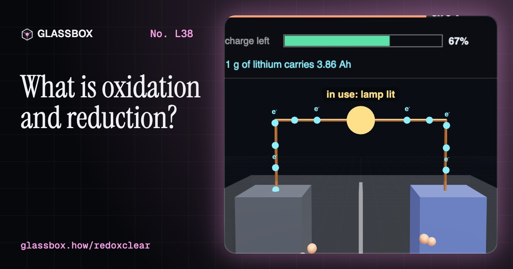
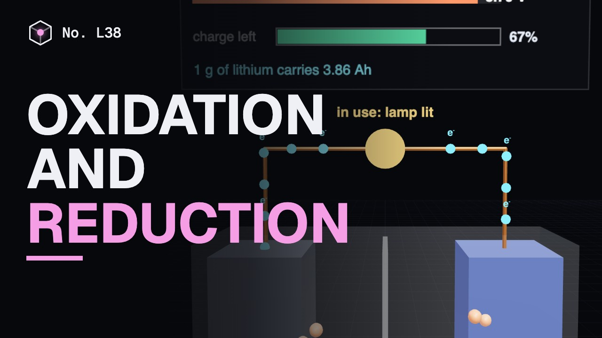
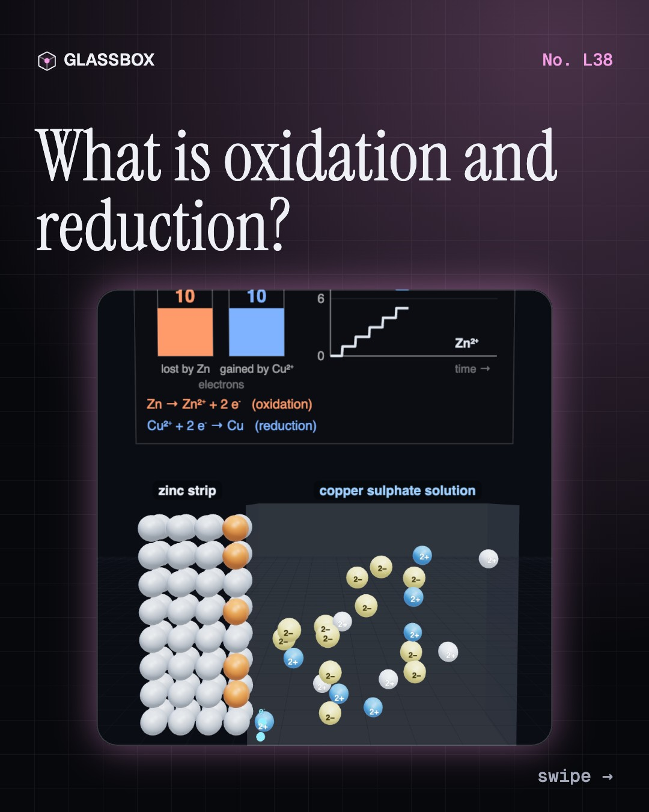
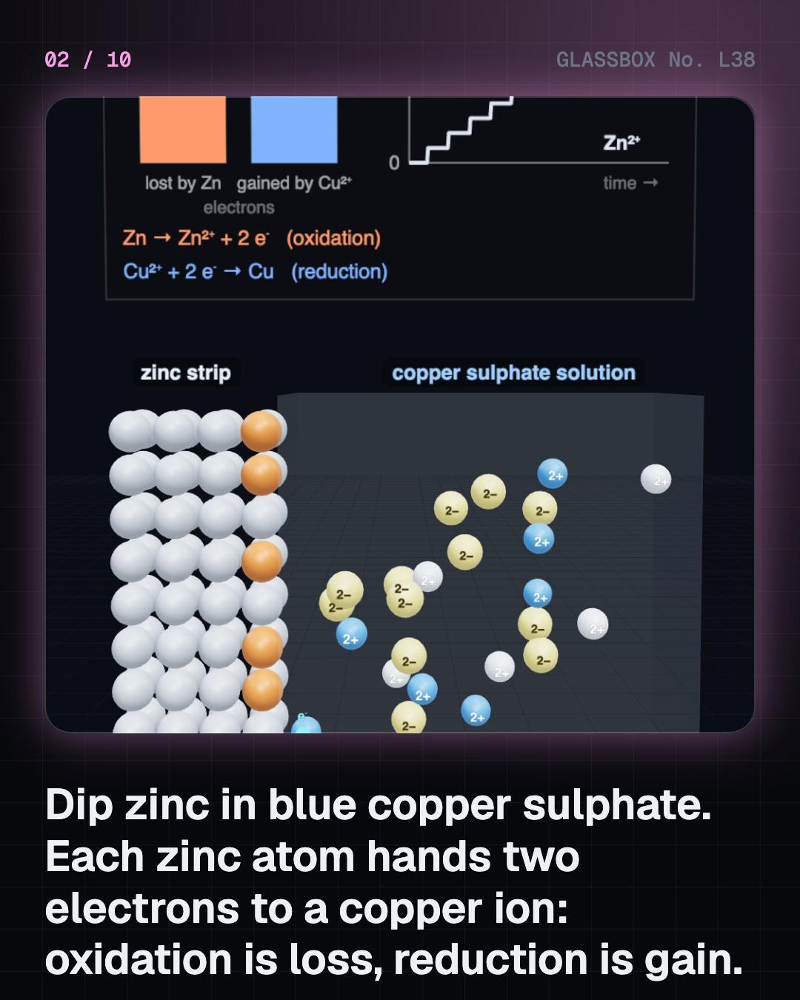
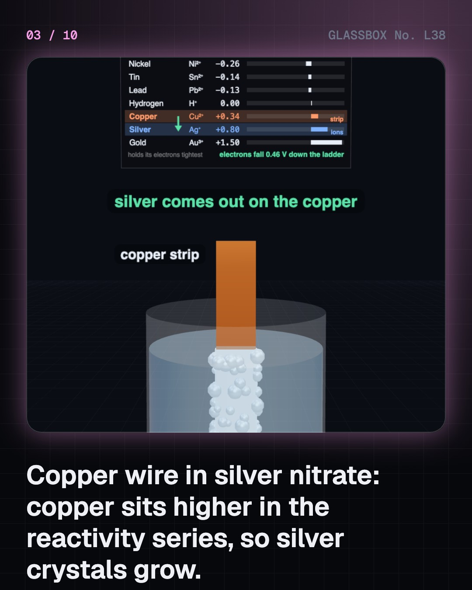
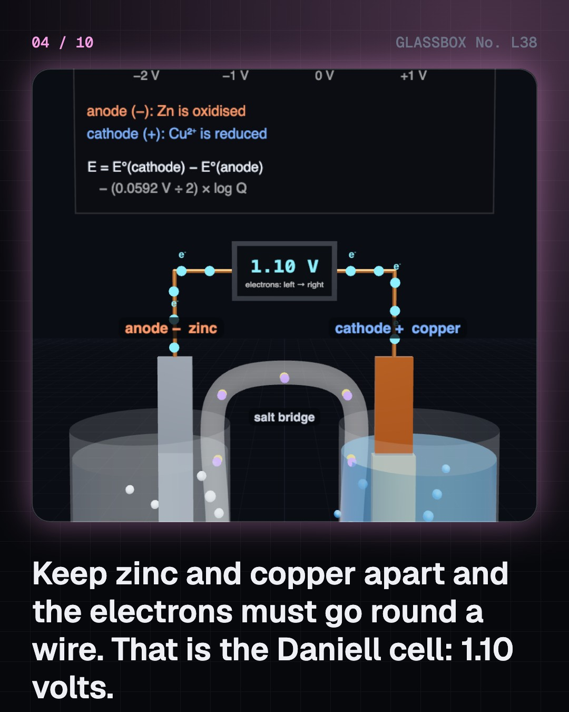

<!-- glassbox:start -->
<!-- Generated from glassbox.json by the Glassbox hub (npm run readme -- redoxclear). Edit glassbox.json, not this block. -->
<p align="center"><a href="https://glassbox.how/e/redoxclear/"></a></p>

<h1 align="center">Oxidation and reduction</h1>

<p align="center"><b>What is oxidation and reduction?</b><br>Dip zinc in blue copper sulphate and watch every electron change hands. Pick any two metals and read the voltage of the battery they make, find out why a drop of water rusts steel faster by the sea, how zinc takes the damage for iron, and why an iron pillar in Delhi has stood in the rain for 1,600 years.</p>

<p align="center"><a href="https://glassbox.how/redoxclear/"><b>▶ Play with it</b></a> &nbsp;·&nbsp; <a href="https://glassbox.how/e/redoxclear/">Read the 60-second explainer</a> &nbsp;·&nbsp; <a href="https://glassbox.how/redoxclear/glassbox/reel.mp4">Watch the 40-second video</a></p>

<p align="center">
  <a href="https://glassbox.how/e/redoxclear/"></a>
  <a href="https://glassbox.how/e/redoxclear/"></a>
  <a href="LICENSE"></a>
  <a href="LICENSE-CONTENT.md"></a>
  <a href="#privacy"></a>
</p>

## In 60 seconds

1. **Electrons change hands.** Put zinc in copper sulphate. Each zinc atom gives two electrons to a copper ion: Zn → Zn²⁺ + 2e⁻ is oxidation, Cu²⁺ + 2e⁻ → Cu is reduction. Oxidation Is Loss, Reduction Is Gain, and the electrons lost always equal the electrons gained.
2. **The reactivity series.** Metals line up by how easily they give electrons away, and each rung has a measured voltage, E°. A metal pushes out any metal below it: iron pushes out copper (+0.79 V), copper pushes out silver, and copper in zinc sulphate does nothing (−1.10 V). Metals above hydrogen fizz in dilute acid.
3. **A cell: electrons the long way round.** Keep the two halves apart, join them with a wire and a salt bridge, and the electrons must flow through the wire. Voltage = E°(cathode) − E°(anode): 1.10 V for zinc and copper, 2.05 V for a lead–acid cell, about 3.7 V for lithium-ion.
4. **Rust, and stopping it.** Rusting is a short-circuited cell: iron gives electrons under a drop of water and oxygen takes them at its edge. Salt speeds it. Paint blocks it, zinc takes the damage in iron's place, chromium gives stainless steel a self-healing skin, and phosphorus gave Delhi's iron pillar a film 0.05 mm thick.
5. **Backwards, beyond, and myths.** A power supply can force electrons uphill: 600 coulombs plates 0.2 g of copper, and smelting aluminium takes about 14 kWh a kilogram. Flames, breathing and bleach are redox too. And oxidation does not need oxygen: sodium burning in chlorine is one.

## Words worth knowing

| Term | Meaning |
|---|---|
| **Oxidation** | Loss of electrons. The oxidation number of an atom goes up. |
| **Reduction** | Gain of electrons. The oxidation number of an atom goes down. |
| **Redox reaction** | A reaction in which electrons pass from one substance to another. Oxidation and reduction always happen together. |
| **Reactivity series** | Metals in order of how easily they lose electrons. A metal displaces any metal below it from solution. |
| **Standard electrode potential (E°)** | A measured voltage for each half-reaction, against hydrogen at 0 V. The gap between two of them is the voltage of the cell they make. |
| **Anode and cathode** | Oxidation happens at the anode and reduction at the cathode. In a battery giving current, the anode is the negative terminal. |
| **Corrosion** | The slow oxidation of a metal by air and water. Rusting is the corrosion of iron. |
| **Electrolysis** | Using electric current to drive a redox reaction backwards, as in electroplating, smelting aluminium or charging a battery. |

## A short history

**From a rustless iron pillar and a stack of zinc and copper discs to the battery in your pocket.**

- **400** · An iron pillar that will not rust (Ironworkers of the Gupta period, Probably Udayagiri, central India; now Delhi)
- **1777** · Lavoisier weighs the air (Antoine Lavoisier, with Marie-Anne Paulze Lavoisier, Paris)
- **1800** · Volta's pile: the first battery (Alessandro Volta, Como and Pavia)
- **1807** · Davy pulls potassium and sodium out of their salts (Humphry Davy, Royal Institution, London)
- **1833** · Faraday counts the charge (Michael Faraday, Royal Institution, London)
- **1836** · Daniell's steady cell (John Frederic Daniell, King's College London)
- **1886** · Cheap aluminium from electrolysis (Charles Martin Hall and Paul Héroult, Oberlin, Ohio, and Paris)
- **1980** · A four-volt cathode (John Goodenough and Koichi Mizushima, Oxford)

The full story, with 25 moments, charts, people and 35 sources: [glassbox.how/e/redoxclear/history](https://glassbox.how/e/redoxclear/history/). The data lives in [`history.json`](history.json).

## Video and slides

Made with the Glassbox studio from this box's storyboard (`window.glassbox.director`). Free to reuse under CC BY 4.0.

<a href="https://glassbox.how/redoxclear/glassbox/video.mp4"></a>

<p><a href="glassbox/slide-1.jpg"></a> <a href="glassbox/slide-2.jpg"></a> <a href="glassbox/slide-3.jpg"></a> <a href="glassbox/slide-4.jpg"></a></p>

| File | What | Size |
|---|---|---|
| [`glassbox/reel.mp4`](https://glassbox.how/redoxclear/glassbox/reel.mp4) | Reel / Short, with captions and soundtrack | 1080×1920 |
| [`glassbox/video.mp4`](https://glassbox.how/redoxclear/glassbox/video.mp4) | YouTube video, with captions and soundtrack | 1920×1080 |
| `glassbox/slide-1…10.jpg` | Instagram carousel | 1080×1350 |
| `glassbox/thumb.jpg` | YouTube thumbnail | 1280×720 |
| `glassbox/cover.jpg` | Share card and repo social preview | 1200×630 |
| [`glassbox/history-reel.mp4`](https://glassbox.how/redoxclear/glassbox/history-reel.mp4) | “History in 10 moments” Reel / Short | 1080×1920 |
| `glassbox/history-slide-*.jpg` | History carousel | 1080×1350 |
| `glassbox/post.json` | Post copy and schedule used by the publish kit | |

## Privacy

This box has no accounts and no ads, and it ships its own fonts and libraries. When you run it yourself it sends nothing anywhere. On glassbox.how, the site's `/bar.js` also loads Glassbox's analytics: **Google Analytics** to count visits (it asks first in the EU, UK and Switzerland, and stays off when your browser sends Global Privacy Control or Do Not Track) and **ClickTrust** to detect bots.

It remembers a few things **in your own browser only**, and never sends them anywhere:

| Browser storage key | What it holds |
|---|---|
| `redoxclear.v1` | Which chapters you have opened, your best quiz scores, and sound on or off. |

Exactly what each one sees is at [glassbox.how/privacy](https://glassbox.how/privacy/).

## Licences

- **Code:** [MIT](LICENSE). Use it, change it, ship it.
- **Explanations, text, images and videos** (`glassbox.json`, `glassbox/`): [CC BY 4.0](LICENSE-CONTENT.md). Credit “Glassbox, glassbox.how/e/redoxclear”.
- **Third-party parts** keep their own licences: [three.js](https://threejs.org) (MIT), [Geist, Instrument Serif](https://openfontlicense.org) (SIL OFL 1.1).
- The Glassbox name and logo aren't covered by either licence. See the [terms](https://glassbox.how/terms/).

Found a mistake? [Open an issue](https://github.com/bdeeps/redoxclear/issues). Corrections happen in public.
<!-- glassbox:end -->

## Run it

It's plain HTML, CSS and JavaScript. No build step and no dependencies. Run locally, it contacts no other website.

```bash
python3 -m http.server 8000
```

Three.js and the fonts ship in `vendor/` and `fonts/`, so it also works offline.

Then open http://localhost:8000.

## How it's built

| File | What |
|---|---|
| `index.html`, `css/app.css` | The page and its styles |
| `js/app.js`, `js/stage.js`, `js/ui.js`, `js/kit.js` | The shared Glassbox 3D engine: chapters, 3D stage, controls, quiz, video director |
| `js/chapters/*.js` | One file per chapter: the 3D model, controls, text, key terms, quiz and video scenes |
| `js/redox.js` | The table of standard electrode potentials and the sums built on it (displacement, cell voltage, Nernst, Faraday), plus chart boards, particles, beakers and layout helpers |
| `glassbox.json` | Title, question, explainer beats, key terms, browser storage and credits shown on glassbox.how |
| `reel` in each chapter | The storyboard the Glassbox studio records into short videos |
| `glassbox/` | The published video, slides, thumbnail and post copy |
| `fonts/`, `vendor/three/` | Self-hosted Geist and Instrument Serif (SIL OFL 1.1) and three.js (MIT) |
